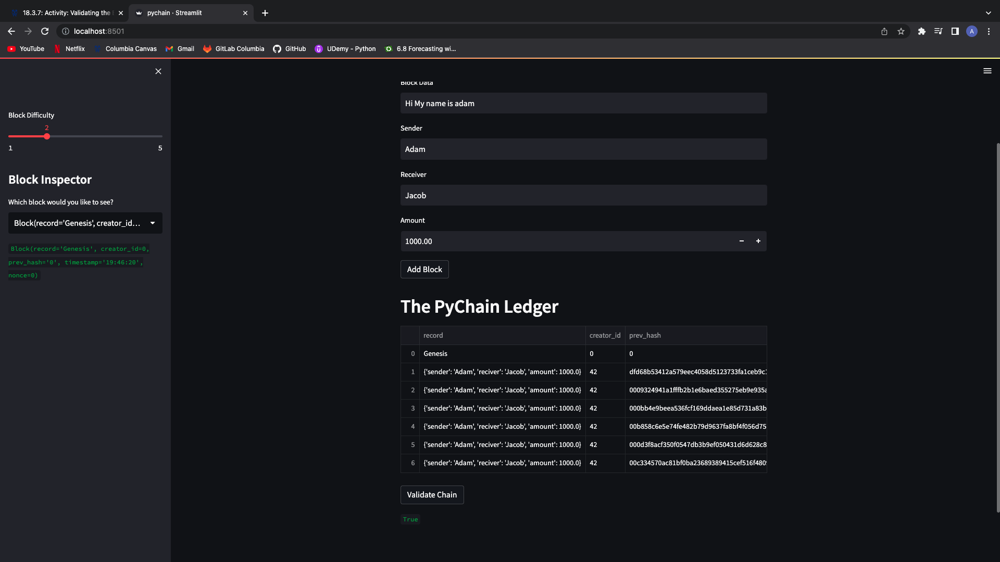

# *Blockchain Application*

The purpose of the Blockchain Application file is to allow the user to add various blocks to a blockchain and test the validity of the chain to ensure its integrity.

---

## **Required Technologies**

This application requires `python 3.7.13`.

---

## Usage

You can initiate the application in your CLI by navigating to the file and opening it.

---

## Contributors

Adam Jimenez - FinTech Student

---

## License

2022 edX Bootcamps

